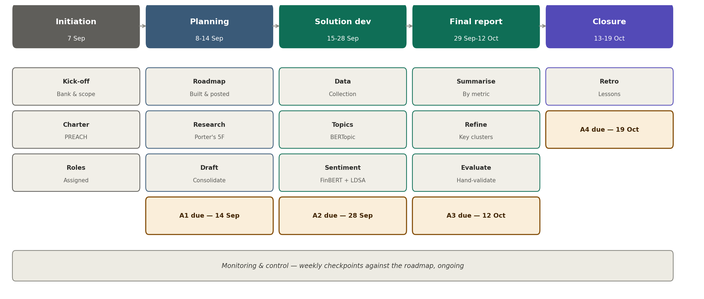

# BoE earnings insights — Group 9

Cambridge Data Science Career Accelerator — employer project with the Bank of England.

- [Assignment 1 Google Doc](https://docs.google.com/document/d/10211H1XyqjrHAKa_ikN5uuYuyTPrDPteUXeQl-QJJlY/edit?usp=drive_link)
- [HSBC investor results](https://www.hsbc.com/investors/results-and-announcements)
- [Barclays financial results](https://home.barclays/investor-relations/reports-and-events/financial-results/)

## Overarching question

Do quarterly earnings announcements and analyst Q&A carry a leading signal about
a firm's prudential condition that reported financial metrics alone don't capture?

## Scope

| | |
|---|---|
| Banks | HSBC and Barclays — UK-incorporated, full PRA oversight, complete public Q&A transcripts |
| Excluded | US banks, Santander — different regulatory regimes, less comparable data |
| Open question | A third US-based bank for geopolitical comparison — undecided, live in group chat |
| In scope | BERTopic topic clustering, FinBERT + LDSA sentiment, summarisation by metric, refined topic modelling on key clusters |
| Out of scope | Video/webcast processing, fine-tuning from scratch, peer benchmarking beyond HSBC/Barclays (stretch goal only) |

## Team

| Name | Role | Belbin |
|---|---|---|
| Taz | Coordinator | Coordinator / Implementer |
| Alfred | Sentiment lead (FinBERT + LDSA) | Specialist / Plant / Shaper |
| Susana Venda | Topic modelling lead (BERTopic) | — |
| Aidan | Pending | — |
| Bupathi | Pending | — |
| Debanjan | Pending | — |
| Rafael | Pending | — |

Data/pipeline, summarisation, business & regulatory research, and editor/QA roles
are still being assigned.

## Where to view / edit

See **[`docs/README.md`](docs/README.md)** for the full map.

| Job | Place |
|---|---|
| Shared write-up | [Assignment 1 Google Doc](https://docs.google.com/document/d/10211H1XyqjrHAKa_ikN5uuYuyTPrDPteUXeQl-QJJlY/edit?usp=sharing) |
| Analysis | [`notebooks/boe_earnings_insights.ipynb`](notebooks/boe_earnings_insights.ipynb) |
| Tasks / roadmap | [Project roadmap](https://github.com/users/susanavenda/projects/3/views/2) |
| Submission files | [`docs/assignment1/`](docs/assignment1/) |

## Repository structure

```
├── README.md
├── requirements.txt
├── Boe_Earnings.code-workspace
├── notebooks/                 # analysis notebooks
│   └── boe_earnings_insights.ipynb
├── data/
│   ├── raw/transcripts/       # HSBC / Barclays Q&A PDFs
│   ├── structured/            # Excel data packs / financial tables
│   └── processed/             # pipeline outputs (CSV, charts)
├── docs/
│   ├── README.md              # view/edit map
│   ├── assignment1/           # scope plan, Word/PDF deliverables
│   ├── project/               # GitHub setup notes, issues.csv
│   └── assets/                # roadmap images
└── scripts/                   # label/milestone/issue helpers
```

## Milestones

| Assignment | Due date |
|---|---|
| A1 — Scope & plan | 14 Sep |
| A2 — Solution pitch | 28 Sep |
| A3 — Final report | 12 Oct |
| A4 — Reflection | 19 Oct |

## Roadmap



Five life-cycle phases: Initiation (7 Sep) → Planning (8–14 Sep) → Execution,
split into Solution dev (15–28 Sep) and Final report (29 Sep–12 Oct) → Closure
(13–19 Oct). Monitoring & control runs throughout via weekly checkpoints against
this roadmap.

## Evaluation approach

No baseline was defined by the Bank, so the team is resolving it directly, three ways:

- **Temporal** — the same firm across successive quarters
- **Peer** — HSBC vs. Barclays, same quarters
- **Structured vs. unstructured** — reported financial metrics against the tone
  and topic mix of the narrative discussing them

Divergence on any axis is a valid finding. A null result — no divergence — is a
valid, reportable outcome, not a failure of the analysis. Model outputs are
hand-validated on a sample rather than trusted on metric alone, and FinBERT's
known weakness on hedged, heavily-lawyered bank language is reported explicitly.

## Tooling

VS Code / Cursor with the Jupyter plugin, run locally rather than on Colab, to avoid
session timeouts over the six-week timeline. Code lives here; the report lives
in one shared Google Doc.

## Setup

```bash
git clone https://github.com/susanavenda/boe-earnings-insights.git
cd boe-earnings-insights
python3 -m venv .venv
source .venv/bin/activate
pip install -r requirements.txt
```

Open `notebooks/boe_earnings_insights.ipynb` and run from Stage 0.

See the **Issues** and **Projects** tabs for the full task breakdown and a live,
editable version of the roadmap above.
