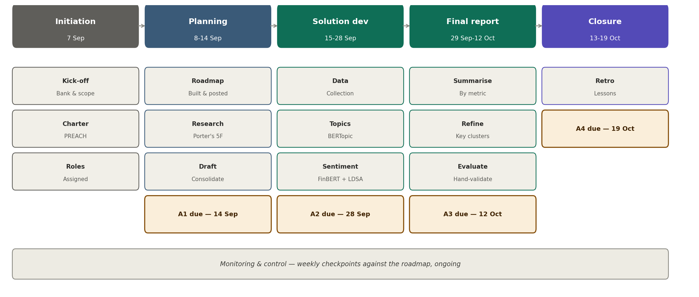

# BoE earnings insights — Group 9

Cambridge Data Science Career Accelerator — employer project with the Bank of England.

**Sell:** an **automation pipeline** that turns IR PDFs + Excel into a versioned **alert / watch / null** supervisory pack (desk UI = output surface; notebook/scripts = factory).

- [Assignment 1 Google Doc](https://docs.google.com/document/d/10211H1XyqjrHAKa_ikN5uuYuyTPrDPteUXeQl-QJJlY/edit?usp=drive_link)
- [HSBC investor results](https://www.hsbc.com/investors/results-and-announcements)
- [Barclays financial results](https://home.barclays/investor-relations/reports-and-events/financial-results/)

## Overarching question

Do quarterly earnings announcements and analyst Q&A carry a leading signal about
a firm's prudential condition that reported financial metrics alone don't capture?

## How the open tabs fit together

| Piece | Role |
|---|---|
| **Pipeline** (this repo) | Factory — notebook + `scripts/` → `data/boe.sqlite` |
| **Desk** (`demo/`) | Stretch — PRA Earnings Desk. `streamlit run demo/app.py` |
| **A2 pitch** | [`docs/assignment2/A2_pitch_outline.md`](docs/assignment2/A2_pitch_outline.md) — 15‑min Background → Approach → Conclusion |
| **Technical report** | [`docs/assignment1/BoE_Earnings_Insights_Report.md`](docs/assignment1/BoE_Earnings_Insights_Report.md) |
| **A3 evidence** | [`docs/assignment3/`](docs/assignment3/) — reproducibility, summarisation, presentation and retrospective notes |
| **A1 scope** | [`docs/assignment1/Group9_CAM_EP_Assignment1.pdf`](docs/assignment1/Group9_CAM_EP_Assignment1.pdf) |

Open this repo via [`Boe_Earnings.code-workspace`](Boe_Earnings.code-workspace) (macOS/Linux). On Windows, open the repository folder directly so VS Code can pick `.venv\\Scripts\\python.exe`.

**Proof episode:** HSBC 2025-interim (H1) → **WATCH (A3)** — soft Q&A, packs agree; peer gap not ALERT (Barclays matched print all-neutral).

## Scope

| | |
|---|---|
| Banks | HSBC and Barclays — UK-incorporated, full PRA oversight, complete public Q&A transcripts |
| Excluded | US banks, Santander — different regulatory regimes, less comparable data |
| Open question | A third US-based bank for geopolitical comparison — undecided, live in group chat |
| In scope | BERTopic topic clustering, FinBERT + LDSA sentiment, summarisation by metric, refined topic modelling on key clusters |
| Out of scope | Video/webcast processing, fine-tuning from scratch, peer benchmarking beyond HSBC/Barclays, Streamlit desk as a deliverable (stretch only) |

## Team

A1 Appendix D. Use these names on the pitch, not the old placeholders.

| Name | Owns | Speaks (A2 MP4) |
|---|---|---|
| **Taz** | Coordinator · editor/QA · A2 deck | Slides 1–3, 11–12 |
| **Susana Venda** | Data pipeline · notebook · desk | Slides 4–5, 9 |
| **Debanjan** | Topics · BERTopic · LDA | Slide 6 topics |
| **Alfred (Qianyi)** | FinBERT · LDSA · FT gate | Slide 6 sentiment, 7 FinBERT |
| **Bupathi** | M6 behavioural signals | Slide 6 M6, 8 protocol |
| **Rafael** | Summarisation · metric briefs · PRA note | Slides 8, 10 |
| **Aidan** | M2a taxonomy · human dual-code · rules | Slide 7 8-way |

## Where things live

| Job | Place |
|---|---|
| Analysis (factory) | [`notebooks/boe_earnings_insights.ipynb`](notebooks/boe_earnings_insights.ipynb) |
| Product desk | Stretch — [`demo/`](demo/) → `streamlit run demo/app.py` |
| A1 submission | [`docs/assignment1/Group9_CAM_EP_Assignment1.pdf`](docs/assignment1/Group9_CAM_EP_Assignment1.pdf) |
| Technical findings | [`docs/assignment1/BoE_Earnings_Insights_Report.md`](docs/assignment1/BoE_Earnings_Insights_Report.md) |
| A2 pitch + checklist | [`docs/assignment2/`](docs/assignment2/) |
| Factory code map | [`docs/code.md`](docs/code.md) · [`scripts/README.md`](scripts/README.md) · [`tests/README.md`](tests/README.md) |
| Tasks / roadmap | [GitHub Project](https://github.com/users/susanavenda/projects/3/views/2) |
| Shared write-up | [Assignment 1 Google Doc](https://docs.google.com/document/d/10211H1XyqjrHAKa_ikN5uuYuyTPrDPteUXeQl-QJJlY/edit?usp=sharing) |

**Rule of thumb:** Notebook/scripts = build the pack · Demo = show the pack · A2 PDF+MP4 = sell the pipeline · Google Doc = team comments.

## Repository structure

```
├── README.md
├── pyproject.toml
├── uv.lock
├── requirements.txt           # generated from the lock for Colab / pip
├── notebooks/boe_earnings_insights.ipynb
├── data/
│   ├── raw/transcripts/       # INPUT — Q&A PDFs
│   ├── structured/            # INPUT — Excel packs
│   ├── boe.sqlite             # system of record (gitignored; rebuild via notebook/scripts)
│   ├── processed/             # internal scratch CSVs (gitignored)
│   └── exports/               # submission tables + MANIFEST.md (run ID, commit) — scripts/export_tables.py
├── docs/
│   ├── code.md                # factory code map (stages, sqlite, invariants)
│   ├── assignment1/           # A1 PDF/DOCX + technical report
│   ├── assignment2/           # pitch, PRA notes, re-run guide
│   ├── project/issues.csv
│   ├── assets/
│   └── hand_validation_sample.csv  # INPUT — human labels
├── scripts/                   # factory + CLI extras — see scripts/README.md
├── demo/                      # PRA Earnings Desk — streamlit run demo/app.py
└── tests/                     # lightweight pytest; 80% factory coverage gate
```

## Milestones

| Assignment | Due date |
|---|---|
| A1 — Scope & plan | 14 Sep |
| A2 — Solution pitch | 28 Sep |
| A3 — Final report | 12 Oct |
| A4 — Reflection | 19 Oct |

## Roadmap



Five life-cycle phases: Initiation (7 Sep) → Planning (8–14 Sep) → Execution,
split into Solution dev (15–28 Sep) and Final report (29 Sep–12 Oct) → Closure
(13–19 Oct). Monitoring & control runs throughout via weekly checkpoints against
this roadmap.

## Evaluation approach

No baseline was defined by the Bank, so the team is resolving it directly, three ways:

- **Temporal** — the same firm across successive quarters
- **Peer** — HSBC vs. Barclays, same calendar periods, **2012–2025** by default (pre-2012 is single-bank; 2026 is a partial year). Missing stays missing — never `fillna(0)` on a gap.
- **Structured vs. unstructured** — reported financial metrics against the tone
  and topic mix of the narrative discussing them

Divergence on any axis is a valid finding. A null result — no divergence — is a
valid, reportable outcome, not a failure of the analysis. Model outputs are
hand-validated on a sample rather than trusted on metric alone, and FinBERT's
known weakness on hedged, heavily-lawyered bank language is reported explicitly.

## Setup

```bash
git clone https://github.com/susanavenda/boe-earnings-insights.git
cd boe-earnings-insights
uv sync --all-extras
source .venv/bin/activate
```

Python 3.12 is required (see `.python-version`). After editing `pyproject.toml`, refresh the lock and the Colab export:

```bash
uv lock
uv export --frozen --no-hashes --no-emit-project --emit-index-url --extra ml -o requirements.txt
```

Google Colab and other pip-only environments still install from the generated file:

```bash
pip install -r requirements.txt
```

Open `notebooks/boe_earnings_insights.ipynb` and run from Stage 0.

[Open the submission notebook in Google Colab](https://colab.research.google.com/github/susanavenda/boe-earnings-insights/blob/main/notebooks/boe_earnings_insights.ipynb). The repository and inputs are public; no GitHub token is required. A clean full run rebuilds the SQLite database and can take more than 2.5 hours. See [`docs/assignment3/colab_reproducibility.md`](docs/assignment3/colab_reproducibility.md) for the verified run and fallback procedure.

**Config is env vars, not a `config.yaml`.** Factory root is resolved by `_locate_root()` (cwd, parent, `BOE_ROOT` / `COLAB_ROOT`, Colab clone/Drive). Override the database with `BOE_DB`. Optional: `BOE_EXPORT_CSV=1`, `BOE_GEMINI_MODEL`, `BOE_LLM_PROVIDER`. API keys stay in a gitignored `.env` or the process environment.

**Data store:** notebook keeps an **in-memory SQLite** working set that auto-flushes to
**`data/boe.sqlite`** (shared with Pipeline scripts).  
**Inputs** are files only (`data/raw/transcripts/`, `data/structured/`, hand-label CSV).  
Optional CSV/PNG mirrors: `BOE_EXPORT_CSV=1`.  
One-shot import of legacy files: `.venv/bin/python scripts/migrate_to_db.py`.

Next-quarter ops: [`docs/assignment2/README.md`](docs/assignment2/README.md).  
Code map (stages, sqlite, invariants): [`docs/code.md`](docs/code.md).  
Tests: `uv run pytest tests/ -q -m "not slow"` — see [`tests/README.md`](tests/README.md).

Desk: `streamlit run demo/app.py` (copies `data/boe.sqlite` into `demo/data/desk.sqlite`).
